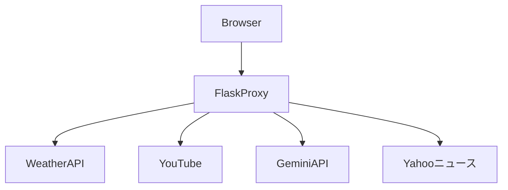

# Flask製パーソナルプロキシサーバー
低速回線や古いブラウザでも天気・YouTube・AI質問などのミニWebアプリを利用できる軽量サーバー

## 技術スタック
- 🐍 Python
- 🧪 Flask (Web Framework)
- 📜 JavaScript (ES5 / ES6)
- ⚙️ Service Worker
- 🗃️ IndexedDB (idb)
- 🤖 Gemini API

## 設計のこだわり
### 制作の目的
本プロジェクトは、古いデバイスや低速回線でも利用できるWebアプリケーション基盤を作ることを目的として開発しました。
1. 古いデバイスを有効活用したい<br>
iPhone5s（iOS12）、Lenovo TAB3（Android6）などの古いデバイスでもインターネットに接続することは可能です。
しかし現在のWebはES6以降のJavaScriptやTLS1.3、ページサイズの肥大化などにより、これらのデバイスでは実質的に多くのサイトが利用できません。
「まだ使えるデバイスなのに活用できないのはもったいない」と考え、ES5環境でも動作する軽量なWebアプリケーションを作ろうと思いました。
2. 災害時でも情報を入手・閲覧したい<br>
NTT東日本によると、能登半島地震での通信断絶について次のように記しています。
>携帯電話についても、地震の直後の停電や土砂崩れにより、伝送路の断絶が発生。
>NTTドコモ、KDDI、ソフトバンク、楽天モバイルの各通信会社において、合計最大839の携帯電話基地局において停波が報告されたといいます（1月3日時点）。
>
>NTT東日本 「能登半島地震で被害を受けた通信インフラはどのように回復したのか？」 [参照リンク](https://business.ntt-east.co.jp/column/bizdrive/noto-quake-comms-restoration.html) より引用

このような状況でも、事前に取得した情報をローカルに保存しておけば、通信が途絶えても情報を確認することができます。
そのため、本プロジェクトでは取得したデータをクライアント側に保存し、オフラインでも閲覧できる仕組みを設計しました。

### コア・コンセプト
このプロジェクトでは以下の制約条件でも動作するWebアプリケーションを目指して設計しています。
- 🐌 低速回線(128kbps程度)でも動作すること
- 🏛️ ES5しか解釈できないブラウザでも動作すること
- 🔓 TLS1.3非対応なブラウザでもLAN内で動作すること
- 👶 CPUやメモリ等のリソースが限られるデバイスでも動作すること
- 🏝️ オフラインでも保存しているデータを確認できること
### アーキテクチャ図
ブラウザは外部サービスと直接通信せず、すべてFlaskプロキシサーバーを経由します。
これにより、クライアントの差異をプロキシで吸収し、

### 特に工夫した点
- 外部サービスとの通信をプロキシサーバーで行い、サーバーでデータを整形することでクライアント側で必要なデータのみを送信できるため、
低速回線でも利用できます。
- Service WorkerによってES6対応ブラウザではHTMLやCSS、JavaScriptやアイコンなど表示に必要なデータやデータ取得時の天気をIndexedDBに保存
するため、低速回線でもページ表示が高速でありオフラインでもページを表示できます。PWAに対応しているため、<br>ネイティブアプリのようなUI・UXで使用できます。
- PydanticでAIの出力を構造化することで、クライアント側で表示するロジックを簡略化できるだけでなく、フロントエンド側での実行時エラー(何も表示されない・意図した出力結果にならない等)
を未然に防ぐことができます。

## 主な機能
1. ⛅筑豊地方に特化した天気アプリ<br>
- 気象庁が配信する1週間の天気予報と、約10分ごとに更新されるアメダスデータをサーバー側で取得・整形し、<br>クライアントへ配信します。
天気アイコンはアスキーアートで表現しており、通信量を削減しています。  
- 送信されるデータ量は100KB未満です。取得したデータはIndexedDBに保存され、オフラインでも閲覧できます。
2. 🎞️YouTubeアプリ<br>
- YouTubeの動画検索・動画取得はサーバー側でyt-dlpを実行し、取得した動画をvideoタグを通じてクライアントへストリーミングします。
- クライアント側では動画再生・音声のみ再生を選択でき、動画解像度や音声ビットレートを指定できます。低速回線でもYouTubeをラジオのように利用できます。
- Service Workerを利用し、動画・音声データやメタデータをクライアント側に保存できます。保存したデータはオフラインでも再生可能です。
- Media Session APIに対応しており、バックグラウンド再生やメディア操作に対応しています。
- 動画・音声メタデータをsqlite3で保存します。このデータは後述のサーバキャッシュアプリで使用されます。
3. 🧑‍🏫AI質問アプリ<br>
- クライアントから送信された質問をサーバーが受信し、Gemini APIへ送信します。
- APIから返された回答はサーバー側で整形し、クライアントへ表示します。
- Pydanticを使用し、AIの出力を「タイトル・要約・説明」の構造化JSONに変換してからクライアントへ送信しています。
- クライアント側では、Gemini APIの思考レベルや使用するモデルを変更できます。
- メモリが限られる環境でも動作できるよう、会話履歴を保持しない一問一答方式を採用しています。
4. 📰ニュースアプリ<br>
- YahooニュースのRSSを１５分間隔で取得し、ニュースソース毎に記事のタイトルを表示します。
- タイトルをクリックすると、RSSのlinkを基にBeautiful Soupで記事の本文のみを抽出して表示します。
- 送信されるデータ量は20KB未満です。
5. 📦サーバキャッシュアプリ
- sqlite3で保存している動画・音声メタデータを基に、サーバに保存している動画や音声を一覧表示します。
- 解像度違いの同じ動画やビットレート違いの同じ音声がある場合は１つにまとめて表示し、解像度やビットレートを指定して再生できます。
- 削除ボタンを押し、削除したい動画や音声をクリックするとサーバから削除できます。
- 外部との通信が一切生じないので、動画や音声をクリックすればすぐに再生が開始されます。

## 技術的課題と解決
レガシーデバイス対応、低速回線対応、オフライン対応といった制約条件で設計したため、以下の技術的課題が生じました。
### 1. 使用できる構文はES5まで<br>
#### 課題<br>
fetch()やPromiseが使えないので、コードが長くなり保守性が低下すること
#### 解決方法
XMLHttpRequestベースの共通ラッパー(GET/POST)を実装しました。通信成功時・失敗時の処理を１つのインターフェースに集約することで、呼び出し側の分岐を減らすことができました。また、(err,data)コールバック形式に統一することで、呼び出し側で扱いやすい形にしました。
##### ES5向けのHTTPラッパー(一部抜粋)
```javascript
// GET用のヘルパー関数
function xhrGetJSON(url, callback) {
    var xhr = new XMLHttpRequest();
    xhr.open('GET', url, true);
    xhr.onload = function () {
        if (xhr.readyState === 4) {
            if (xhr.status >= 200 && xhr.status < 300) {
                try {
                    var data = xhr.responseText ? JSON.parse(xhr.responseText) : null;
                    callback(null, data);
                } catch (e) {
                    console.error('Failed to parse JSON:', e);
                    callback(new Error('Failed to parse JSON'));
                }
            } else {
                callback(new Error('Failed to fetch data: ' + xhr.status));
            }
        }
    };
    xhr.onerror = function () {
        callback(new Error('Network error'));
    };
    xhr.send(null);
}
```
##### 結果
必要最低限のコード長で非同期のHTTP通信を実現でき、定義と実装を分離したため保守性を確保することができました。

### 2. 128kbpsで実用可能なレイテンシを確保すること<br>
#### 課題
転送速度がボトルネックになりUXが著しく低下します。
#### 解決方法
- 外部サイトへの通信のレスポンスをサーバ側で加工し、必要最低限のデータをクライアントに渡すことで転送量を削減しました。
- テキスト主体の表現(天気アイコンをアスキーアート化、ニュースは画像を省きテキストのみ)にすることで転送量を削減しました。
- キャッシュ前提の設計にし、同一リソースの再取得を抑制しました。
- flask-compressを使いgzip圧縮を有効にすることで転送量を削減しました。
#### 結果
ネットワークタブで128kbpsに制限して計測した結果が以下の結果です。
| アプリ | 初回転送量 | 初回転送時間 | キャッシュ後転送量 | キャッシュ後転送時間 |
| --- | --- | --- | --- | --- |
| 天気アプリ | 13.4 KB | 5.21s| 7.0 KB | 2.79s |
| ニュースアプリ | 510KB | 33.28s* | 18.2KB | 1.76s|

*専用フォントを読み込み終わるまでの時間。1.69sでニュースのタイトルを表示

初回の読み込みは時間がかかるものの、キャッシュ後は実用的な時間で表示することができました。

### 3. オフラインで使用できるようにデータを適切にキャッシュすること<br>
特に動画・音声データのクライアント側での保存・管理方法についての知識が無かったため実装方法が不明でした。
### 4. ios12の制約
script type="module"を認識しないことや、後述するService Workerの対応が不完全でありキャッシュ周りの挙動が不安定であることが課題でした。
   


