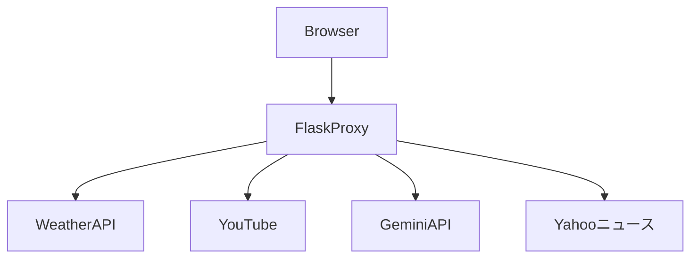

# Flask製パーソナルプロキシサーバー
レガシーデバイス・低速回線・オフライン環境でも動くミニWebアプリ基盤

## 技術スタック
- 🐍 Python
- 🧪 Flask (Web Framework)
- 📜 JavaScript (ES5 / ES6)
- ⚙️ Service Worker (workbox)
- 🗃️ IndexedDB (idb,dexie.js)
- 🤖 Gemini API
- 🎞️ yt-dlp
- 🍲 Beautiful Soup

## セットアップ

### 前提条件
- Docker / Docker Compose
- Git
- Gemini API キー（[Google AI Studio](https://aistudio.google.com/)で取得）
- 自宅などで試す場合はYouTubeのログイン情報が入ったCookieがほぼ必須です(未検証)。Cookie取得時は**メインではない**Googleアカウントを使用することを強く推奨します

### 手順

1. リポジトリをクローンします
```
git clone https://github.com/woials/Flask-proxy
cd Flask-proxy
```

2. `.env` ファイルをプロジェクトルートに作成します
```
GEMINI_API_KEY=your_gemini_api_key
SECRET_KEY=your_secret_key
USER=your_username
PASSWORD=your_password
```

3. Dockerで起動します
```
docker-compose build
docker-compose up
```

4. ブラウザで `http://localhost:5000` にアクセスします

5. (YouTubeアプリが動作しない場合)Cookieを取得します。  
**メインではない**GoogleアカウントでYouTubeにログインします。
Cookieの取得方法はさまざまありますが、拡張機能を使うのが１番手軽です。
[yt-dlpのFAQ](https://github.com/yt-dlp/yt-dlp/wiki/FAQ)では、
Chrome系ブラウザの場合は[Get cookies.txt LOCALLY](https://chromewebstore.google.com/detail/get-cookiestxt-locally/cclelndahbckbenkjhflpdbgdldlbecc)
FireFox系ブラウザの場合は[cookies.txt](https://addons.mozilla.org/en-US/firefox/addon/cookies-txt/)が紹介されています。
取得したCookieはプロジェクトルートに配置してください。

## 設計のこだわり
### 制作の目的
本プロジェクトは、古いデバイスや低速回線でも利用できるWebアプリケーション基盤を作ることを目的として開発しました。
1. 古いデバイスを有効活用したい  
iPhone5s（iOS12）、Lenovo TAB3（Android6）などの古いデバイスでもインターネットに接続することは可能です。
しかし現在のWebはES6以降のJavaScriptやTLS1.3、ページサイズの肥大化などにより、これらのデバイスでは実質的に多くのサイトが利用できません。
「まだ使えるデバイスなのに活用できないのはもったいない」と考え、ES5環境でも動作する軽量なWebアプリケーションを作ろうと思いました。
2. 災害時でも情報を入手・閲覧したい  
NTT東日本によると、能登半島地震では最大839の携帯電話基地局で停波が発生したとされています。  
(出典:NTT東日本 「能登半島地震で被害を受けた通信インフラはどのように回復したのか？」 [参照リンク](https://business.ntt-east.co.jp/column/bizdrive/noto-quake-comms-restoration.html) )  
このような状況でも、事前に取得した情報をローカルに保存しておけば、通信が途絶えても情報を確認することができます。
そのため、本プロジェクトでは取得したデータをクライアント側に保存し、オフラインでも閲覧できる仕組みを設計しました。

### コア・コンセプト
このプロジェクトでは以下の制約条件でも動作するWebアプリケーションを目指して設計しています。
- 🐌 低速回線(128kbps程度)でも動作すること
- 🏛️ ES5しか解釈できないブラウザでも動作すること
- 🔓 TLS1.3非対応なブラウザでもLAN内で動作すること
- 👶 CPUやメモリ等のリソースが限られるデバイスでも動作すること
- 🏝️ オフラインでも保存しているデータを確認できること
### アーキテクチャ図
ブラウザは外部サービスと直接通信せず、すべてFlaskプロキシサーバーを経由します。
外部サービスごとの差異やレスポンス形式、レート制限などをサーバ側で吸収し、クライアントを単純化する構成を採用しています。

```mermaid
graph TD
Browser --> FlaskProxy
FlaskProxy --> WeatherAPI
FlaskProxy --> YouTube
FlaskProxy --> GeminiAPI
FlaskProxy --> Yahooニュース
```
### 特に工夫した点
- 外部サービスとの通信をプロキシサーバーで行い、サーバーでデータを整形することでクライアント側で必要なデータのみを送信できるため、
低速回線でも利用できます。
- Service WorkerによってES6対応ブラウザではHTMLやCSS、JavaScriptやアイコンなど表示に必要なデータやデータ取得時の天気をIndexedDBに保存
するため、低速回線でもページ表示が高速でありオフラインでもページを表示できます。PWAに対応しているため、ネイティブアプリのようなUI・UXで使用できます。
- PydanticでAIの出力を構造化することで、クライアント側で表示するロジックを簡略化できるだけでなく、フロントエンド側での実行時エラー(何も表示されない・意図した出力結果にならない等)
を未然に防ぐことができます。

## 主な機能
1. ⛅筑豊地方に特化した天気アプリ  


https://github.com/user-attachments/assets/de56ff0c-3d88-4747-a18f-7b669af8f787


- 気象庁が配信する1週間の天気予報と、約10分ごとに更新されるアメダスデータをサーバー側で取得・整形し、  クライアントへ配信します。
天気アイコンはアスキーアートで表現しており、通信量を削減しています。  
- 送信されるデータ量は、初回ロード時で25KB程度、次回以降ロード時で5KB未満です。取得したデータはIndexedDBに保存され、オフラインでも閲覧できます。
2. 🎞️YouTubeアプリ  


https://github.com/user-attachments/assets/059f47ef-7d05-46bb-a77a-b0afcc76f819


- YouTubeの動画検索・動画取得はサーバー側でyt-dlpを実行し、取得した動画をvideoタグを通じてクライアントへストリーミングします。
- クライアント側では動画再生・音声のみ再生を選択でき、動画解像度や音声ビットレートを指定できます。低速回線でもYouTubeをラジオのように利用できます。
- Service Workerを利用し、動画・音声データやメタデータをクライアント側に保存できます。保存したデータはオフラインでも再生可能です。
- Media Session APIに対応しており、バックグラウンド再生やメディア操作に対応しています。
- 動画・音声メタデータをsqlite3で保存します。このデータは後述のサーバキャッシュアプリで使用されます。
3. 🧑‍🏫AI質問アプリ  


https://github.com/user-attachments/assets/1c5b1175-4fa3-45b3-9753-814ce4ca7dd2


- クライアントから送信された質問をサーバーが受信し、Gemini APIへ送信します。
- APIから返された回答はサーバー側で整形し、クライアントへ表示します。
- Pydanticを使用し、AIの出力を「タイトル・要約・説明」に構造化・検証し、その後クライアントへ送信しているので、Gemini APIの出力の揺らぎによるUI崩れや実行時エラー、悪意のあるスクリプトの実行を防止しています。
- クライアント側では、Gemini APIの思考レベルや使用するモデルを変更できます。
- メモリが限られる環境でも動作できるよう、会話履歴を保持しない一問一答方式を採用しています。
4. 📰ニュースアプリ  


https://github.com/user-attachments/assets/d87cc676-6796-4c30-95e5-cbdfb55df25d


- YahooニュースのRSSを１５分間隔で取得し、ニュースソース毎に記事のタイトルを表示します。
- タイトルをクリックすると、RSSのlinkを基にBeautiful Soupで記事の本文のみを抽出して表示します。
- 送信されるデータ量は、初回ロード時で800KB程度、次回以降ロード時はおおよそ550KB程度です。取得したデータはIndexedDBに保存され、オフラインでも閲覧できます。
5. 📦サーバキャッシュアプリ


https://github.com/user-attachments/assets/4d735c09-635f-4dd7-ab27-5ac2c838f05a


- sqlite3で保存している動画・音声メタデータを基に、サーバに保存している動画や音声を一覧表示します。
- 解像度違いの同じ動画やビットレート違いの同じ音声がある場合は１つにまとめて表示し、解像度やビットレートを指定して再生できます。
- 削除ボタンを押し、削除したい動画や音声をクリックするとサーバから削除できます。
- 外部との通信が一切生じないので、動画や音声をクリックすればすぐに再生が開始されます。

## 技術的課題と解決
レガシーデバイス、低速回線、オフラインといった制約条件で設計したため、以下の技術的課題が生じました。
### 1. ES5制約下での非同期通信の保守性確保  
#### 課題  
fetch()やPromiseが使えないので、コードが長くなり保守性が低下すること
#### 解決方法
XMLHttpRequestベースの共通ラッパー(GET/POST)を実装しました。通信成功時・失敗時の処理を１つのインターフェースに集約することで、呼び出し側の分岐を減らすことができました。また、(err,data)コールバック形式に統一することで、呼び出し側で扱いやすい形にしました。
##### ES5向けのHTTPラッパー(一部抜粋)
```javascript
// GET用のヘルパー関数
function xhrGetJSON(url, callback) {
    var xhr = new XMLHttpRequest();
    xhr.open('GET', url, true);
    xhr.onload = function () {
        if (xhr.readyState === 4) {
            if (xhr.status >= 200 && xhr.status < 300) {
                try {
                    var data = xhr.responseText ? JSON.parse(xhr.responseText) : null;
                    callback(null, data);
                } catch (e) {
                    console.error('Failed to parse JSON:', e);
                    callback(new Error('Failed to parse JSON'));
                }
            } else {
                callback(new Error('Failed to fetch data: ' + xhr.status));
            }
        }
    };
    xhr.onerror = function () {
        callback(new Error('Network error'));
    };
    xhr.send(null);
}
```
##### 結果
必要最低限のコード長で非同期のHTTP通信を実現でき、定義と実装を分離したため保守性を確保することができました。

### 2. 128kbpsで実用可能なレイテンシを確保すること  
#### 課題
転送速度がボトルネックになりUXが著しく低下します。
#### 解決方法
- 外部サイトへの通信のレスポンスをサーバ側で加工し、必要最低限のデータをクライアントに渡すことで転送量を削減しました。
- テキスト主体の表現(天気アイコンをアスキーアート化、ニュースは画像を省きテキストのみ)にすることで転送量を削減しました。
- キャッシュ前提の設計にし、同一リソースの再取得を抑制しました。
- Flask-compressを使いgzip圧縮を有効にすることで転送量を削減しました。
#### 結果
ネットワークタブで128kbpsに制限して計測した結果が以下の結果です。
| アプリ | 初回転送量 | 初回転送時間 | キャッシュ後転送量 | キャッシュ後転送時間 |
| --- | --- | --- | --- | --- |
| 天気アプリ | 25.4 KB | 5.58s| 3.3 KB | 1.12s |
| ニュースアプリ | 764MB | 45.24s* | 526KB | 13.03s**|

*フォントファイルを読み込み終わるまでの時間。25.44sでニュースのタイトルを表示
**イベントストリームを受信し終わるまでの時間。ニュースアプリを開くとすぐにタイトル表示

初回の読み込みは時間がかかるものの、キャッシュ後は実用的な時間で表示することができました。

### 3. オフラインで使用できるようにデータを適切にキャッシュすること  
#### 課題
ネットワークが利用できない環境でもニュースや天気などのデータを閲覧できるよう、クライアント側でデータの保存・更新・読み込みを管理する必要がありました。
#### 解決方法
- workbox(Service Workerを簡単に扱えるようにするためのライブラリ)を使い、静的データ(HTML/CSSなど)はCacheFirst、動的データ(APIレスポンスなど)はStaleWhileRevalidateで保存することで、
  データの保存と更新を自動で行えるようにしました。
- dexie.js(IndexedDBを簡単に扱えるようにするためのライブラリ)を利用してIndexedDBを操作し、ニュース・天気・動画・音声などのデータをクライアント側に保存しました。
- オフライン時はIndexedDBにあるデータを優先的に読み込むことで、通信ができない状況でもコンテンツを閲覧できるようにしました。
#### 結果
アプリ利用時にデータが自動でキャッシュされ、オフライン環境でも保存済みコンテンツを閲覧できるようになりました。
また、静的アセットをキャッシュから配信することで、ページ表示速度の向上にもつながりました。

### 4. iOS 12を含むレガシーデバイスへの段階的対応
#### 課題
iOS 12 では ES Modules をサポートしておらず、Service Worker の実装も不完全です。
特にキャッシュ容量が最大約50MB程度に制限されるため、動画や音声を含む大容量データの保存が現実的ではありません。
そのため、
- レガシーデバイスでは最低限の機能でアプリを利用できること
- 新しいデバイスではService Workerによるキャッシュ機能やオフライン機能を利用できること
の両立が必要でした。
#### 解決方法
- トップページにあたるindex.htmlでService Workerが使えるか判定し、利用可能であればService Workerの登録を行うようにしました。
- YouTubeアプリにおいて、Service Worker対応のscript.jsとService Worker非対応のlegacy_script.jsを分離して実装しました。
- HTML側でJavaScriptを動的ロードし、BigInt・WebAssembly・async()=>{}のサポートの有無を利用して、実行環境に応じたスクリプトを選択する構成にしました。
- 他のアプリについてはJavaScriptではES5までの構文で実装し、古いブラウザでも動作するようにしました。
##### JavaScript動的ロードのコード
```html
    <script>
        var isModern = false;
        try {

            if (typeof BigInt !== "undefined" && typeof WebAssembly !== "undefined") {
                // さらに async 構文のチェック
                new Function('async () => {}');
                isModern = true;
            }
        } catch (e) {
            isModern = false;
        }

        var s = document.createElement('script');
        if (isModern) {
            s.type = 'module';
            s.src = '/static/js/script.js';

        } else {
            s.src = '/static/js/legacy_script.js';
            // iOS 12以前はここに来る

        }
        document.head.appendChild(s);
    </script>
``` 
#### 結果
実行環境に応じて読み込むJavaScriptを切り替えることで、ES Modules非対応のレガシーデバイスでもアプリを利用できるようになりました。
また、新しいデバイスではService Workerを利用したオフライン対応やキャッシュ機能を有効化し、Progressive Enhancementを実現しました。

## 技術選定の理由
### Flask
Flaskを選んだ理由は、Flaskが最小限の機能しか持たないため、ルーティングやリクエスト処理、レスポンス生成など、
Webサーバの基礎的な仕組みを自分で実装しながら学べるためです。また、Pythonの学習も兼ねています。
DjangoやFastAPIはORMや認証など多くの機能を内包していますが、
今回は１から作って学びたいため、Flaskの薄さが学習に適していると判断しました。

### Gemini API
GeminiAPIを選んだ理由は、個人開発においてランニングコストを抑えることを優先したためです。
OpenAI APIと比較検討しましたが、Gemini APIは無料枠が大きく、
今回の用途（一問一答・構造化出力）では性能面でも十分と判断しました。

### SQLite3
SQLite3を採用した理由は、他のDBMSと比較して軽量であり、サーバのリソース消費を抑えられるためです。
同時書き込みに弱いという制約がありますが、本プロジェクトの利用者は1名のみであるため、
この制約が問題になるケースはないと判断しました。

### yt-dlp
yt-dlpを採用した理由は、動画データをプロキシサーバ側で取得・保存することで、クライアントとYouTube間の通信回数を削減しキャッシュサーバとして機能させるためです。
保存済みの動画はYouTubeサーバへのアクセスなしに即時配信できるため、再生開始までの時間を短縮できます。

## 今後の課題と展望
### 既存機能の改善
- YouTubeのストリーミング再生対応（現在はダウンロード後に再生）
- プレイリスト単位での一括ダウンロード・再生
- 天気予報の地域設定

### 新機能
- 気象警報・注意報のプッシュ通知
- オフライン時のAI質問キューイング（オンライン復帰時に回答をプッシュ通知）  
  ※災害時など通信が断絶した環境での利用を想定
- ニュース・天気・AIチャットを統合したダッシュボード

### 長期的な展望
- ターミナルから各アプリを操作できるTUIアプリの制作  
  ※低スペック環境での利用を想定

## ライセンス

本プロジェクトは MIT License の下で公開しています。  
詳細は [LICENSE](./LICENSE) を参照してください。

また、使用しているサードパーティライブラリのライセンス情報は  
[THIRDPARTY_LICENSES.txt](./THIRDPARTY_LICENSES.txt) に記載しています。
